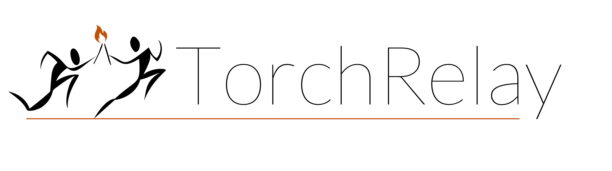

<picture align="center">
  <source media="(prefers-color-scheme: dark)" srcset="docs/images/torchrelay_logo_full_dark.png">
  <source media="(prefers-color-scheme: light)"  srcset="docs/images/torchrelay_logo_full.png">
  
</picture>

This is a lightweight packages that:

- implements backward-compatible functions that mimic the modern PyTorch API
  (`linalg`, `fft`, `movedim`, ...)
- implements extended variants of functions from the PyTorch functional API
  (`pad`, `one_hot`, ...)
- implements a range of helpers compatible with TorchScript.


**Warning:** This package is under active development and still largely untested.

# API

## basic helpers

### indexing

```python
def moveelem(input, source, destination, dim=-1):
"""Move elements in a tensor""" ...

def slice_tensor_along(x, index, dim=-1):
"""Index a tensor along one dimensions.""" ...

def slice_tensor(x, index, dim=None):
"""Index a tensor along one or several dimensions.""" ...
```

### shapes

```python
def movedims(input, source, destination):
"""Moves the position of one or more dimensions""" ...

def movedims_front2back(tensor, dim):
"""Move the first N dimensions to the back""" ...

def movedims_back2front(tensor, dim):
"""Move the last N dimensions to the front""" ...

def shiftdim(x, n=None):
"""Shift the dimensions of x by n.""" ...
```

### Tensor backend (dtype and device)

```python
def to(*args, dtype=None, device=None):
  """Move/convert tensors to a common dtype or device."""
  ...

def to_max_backend(*args, force_float=False, dtype=None, device=None):
  """Move to a common dtype and device."""
  ...

def to_max_device(*args):
  """Move to a common device."""
  ...

def to_max_dtype(*args):
  """Move to a common data type."""
  ...

def get_backend(x):
  """Return the backend (dtype and device) of a tensor"""
  ...

def max_backend(*args, dtype=None, device=None):
  """Get the (max) dtype and device."""
  ...

def max_device(*args):
  """Find a common device for all inputs."""
  ...

def max_dtype(*args, force_float=False):
  """Find the maximum data type from a series of inputs."""
  ...

def as_torch_dtype(dtype, byteswap=True, upcast=False):
  """Convert a numpy data type (or a data type name) to a torch data dtype."""
 ...

def as_numpy_dtype(dtype, upcast=False):
  """Convert a torch data type (or a data type name) to a torch data dtype."""
 ...
```

## extensions

### itertools

```python
def product(*inputs, r=1, **backend): ...
"""Cartesian product of a set."""

def permutations(input, r=None): ...
"""All possible r-length permutations of a set."""

def invert_permutation(perm):
"""Return the inverse of a permutation."""
```

### labels

```python
def isin(tensor, labels): ...
"""Returns a mask for elements that belong to labels"""

def one_hot(
    x, dim=-1, exclude_labels=None, exclude_missing=False, max_label=None,
    implicit=False, implicit_index=0, dtype=None, return_lookup=False,
): ...
"""One-hot encode a volume of labels."""

def merge_labels(x, lookup): ...
"""Relabel a label tensor according to a lookup table."""

```

### out-of-bounds extrapolation

```python
def pad(inp, padsize, mode='constant', value=0, side=None): ...
"""Pad a tensor."""

def ensure_shape(inp, shape, mode='constant', value=0, side='post'): ...
"""Pad/crop a tensor so that it has a given shape."""

def roll(inp, shifts=1, dims=None, bound='circular'): ...
"""Like `torch.roll`, but with any boundary condition."""
```

## backward compatibility

### base

```python
def multivers.movedim(x, source: int, destination: int): ...
"""Backward compatible `torch.movedim`"""

def multivers.meshgrid_ij(*tensors): ...
"""Backward compatible `torch.meshgrid(..., indexing="ij")`"""

def multivers.meshgrid_xy(*tensors): ...
"""Backward compatible `torch.meshgrid(..., indexing="xy")`"""
```

### linalg

TODO

## torchscript

### indexing

```python
def jit.ind2sub(ind: Tensor, shape: List[int]): ...
"""Convert linear indices into sub indices (i, j, k)."""

def jit.sub2ind(subs: Tensor, shape: List[int]): ...
"""Convert sub indices (i, j, k) into linear indices."""

def jit.sub2ind_list(subs: List[Tensor], shape: List[int]): ...
"""Convert sub indices (i, j, k) into linear indices."""
```

### meshgrid

```python
def jit.meshgrid_list_ij(tensors: List[Tensor]): ...
"""TorchScript compatible `torch.meshgrid(tensors, indexing="ij")`"""

def jit.meshgrid_list_xy(tensors: List[Tensor]): ...
"""TorchScript compatible `torch.meshgrid(tensors, indexing="xy")`"""
```

### math

```python
def jit.floor_div(x: Tensor, y: Tensor): ...
"""TorchScript and Backward compatible `torch.div(..., mode="floor")`"""

def jit.floor_div_int(x: Tensor, y: int): ...
"""TorchScript and Backward compatible `torch.div(..., mode="floor")`"""

def jit.floor_trunc(x: Tensor, y: Tensor): ...
"""TorchScript and Backward compatible `torch.div(..., mode="trunc")`"""

def jit.floor_trunc_int(x: Tensor, y: int): ...
"""TorchScript and Backward compatible `torch.div(..., mode="trunc")`"""

# powers
def jit.square(x): ...
def jit.cube(x): ...
def jit.pow4(x): ...
def jit.pow5(x): ...
def jit.pow6(x): ...
def jit.pow7(x): ...

def jit.square_(x): ...
def jit.cube_(x): ...
def jit.pow4_(x): ...
def jit.pow5_(x): ...
def jit.pow6_(x): ...
def jit.pow7_(x): ...
```

### tensors

```python
def jit.sum_list_tensor(x: List[Tensor]) -> Tensor: ...
"""Compute the sum of tensors in the list. Equivalent to `sum(x)`."""

def jit.prod_list_tensor(x: List[Tensor]) -> Tensor:
"""Compute the product of tensors in the list."""

def jit.movedim(x, source: int, destination: int):
"""Backward compatible `torch.movedim`"""
```

### python

```python
def jit.pad_list_int(x: List[int], length: int) -> List[int]: ...
r"""Pad/crop a list of int until it reaches a target length."""

def jit.pad_list_float(x: List[float], length: int) -> List[float]: ...
r"""Pad/crop a list of float until it reaches a target length."""

def jit.pad_list_str(x: List[str], length: int) -> List[str]: ...
r"""Pad/crop a list of str until it reaches a target length."""

def jit.any_list_bool(x: List[bool]) -> bool: ...
"""TorchScript equivalent to `any(x)`"""

def jit.all_list_bool(x: List[bool]) -> bool: ...
"""TorchScript equivalent to `all(x)`"""

def jit.sum_list_int(x: List[int]) -> int: ...
"""Compute the sum of elements in the list. Equivalent to `sum(x)`."""

def jit.prod_list_int(x: List[int]) -> int: ...
"""Compute the product of elements in the list"""

def jit.reverse_list_int(x: List[int]) -> List[int]: ...
"""TorchScript equivalent to `x[::-1]`"""

def jit.cumprod_list_int(x: List[int], reverse: bool = False,
                         exclusive: bool = False) -> List[int]: ...
"""Cumulative product of elements in the list"""
```